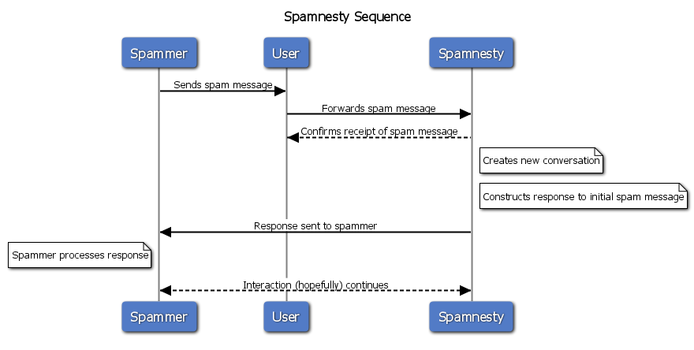

Spamnesty
========

Spamnesty lets you waste spammers' time by pretending it's a person and talking
to them. The URL to the service is:

[https://spa.mnesty.com](https://spa.mnesty.com/)

Running
-------

To run Spamnesty, just clone this repository, install docker-compose and start
everything up:

~~~
pip install docker-compose
docker-compose up

# You can create a superuser (or run other manage.py commands) like so:
docker-compose run web /code/manage.py createsuperuser <yourusername>
~~~

If you access [http://localhost/](http://localhost/), you should see the
Spamnesty home page!

To access the admin interface, create a user:

~~~
docker-compose run web /code/manage.py createsuperuser
~~~

and go to [http://localhost/entrary/](http://localhost/entrary/) the log in.

Contributing
------------

To contribute, just issue a merge request on our repository. Make sure tests
pass first, though:

~~~
docker-compose run web /code/manage.py test
~~~

Stuff
-----

Here's a sequence diagram of how the flow works:

